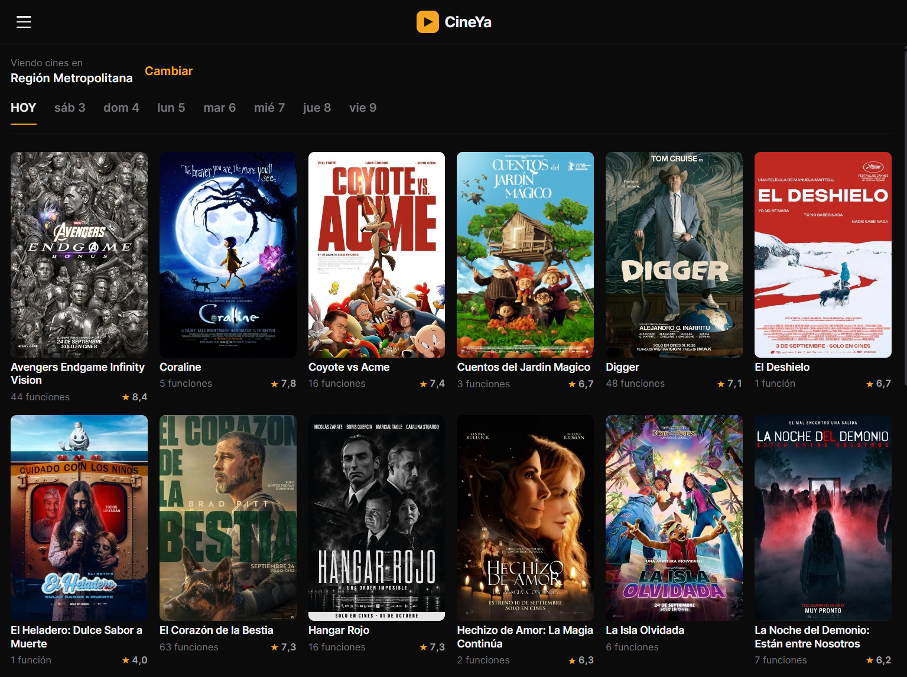
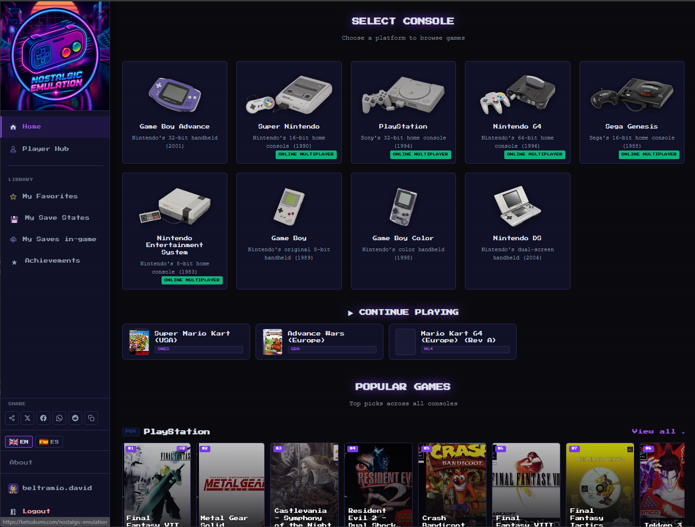
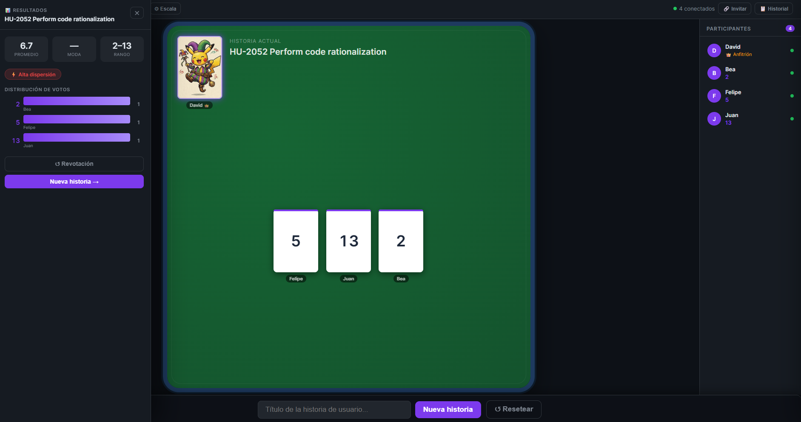
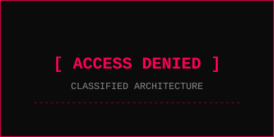
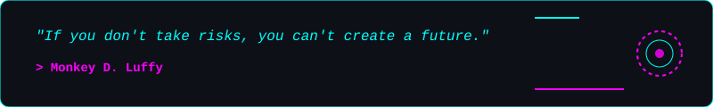

  

 

  <a href="https://github.com/Daividkj" target="_blank" rel="noopener noreferrer">
    +System+initialized...;>+Software+Architect+|+Technical+Lead;>+Building+scalable+enterprise+systems...;>+DevOps+|+Cloud+Infrastructure+|+Data..." alt="Typing SVG" />
  </a>

  

  <blockquote>
    
<b>Software Architect & Technical Lead</b> with 5+ years of experience driving large-scale implementations and system architecture across regional and multinational organizations. Proven track record of aligning complex technical strategies with business objectives.

  </blockquote>
  <ul>
    <li><b>Architecture & Leadership:</b> Technical design and deployment of highly scalable enterprise solutions. Extensive experience overseeing multi-country operations, defining robust architectural blueprints, and guaranteeing system reliability under high-concurrency demands.</li>
    <li><b>Complex Integrations:</b> Expertise in orchestrating intricate integration patterns and establishing rigorous data contracts. Capable of seamlessly bridging modern corporate microservices, distributed third-party APIs, and legacy core systems to create cohesive technological ecosystems.</li>
    <li><b>Cloud Infrastructure & DevOps:</b> Architecting resilient, highly available cloud infrastructures centered around containerization and scalable orchestration. Dedicated to fostering a culture of continuous delivery, ensuring automated, secure, and zero-downtime release lifecycles.</li>
    <li><b>AI & Advanced Analytics:</b> Strategic integration of artificial intelligence capabilities into enterprise workflows. Deep focus on transforming complex operational data into actionable business intelligence through advanced modeling and automated reporting structures.</li>
    <li><b>Engineering & Agile Delivery:</b> Solid foundation in algorithmic problem-solving, secure API governance, and technical mentorship. Adept at driving cross-functional, high-performance teams from conception to delivery by championing agile frameworks and rigorous engineering standards.</li>
  </ul>

  

  <blockquote>
    
<b>Advanced AI Integration & Self-Hosted Infrastructure:</b> Extensive experience deploying, orchestrating, and interacting with both commercial and locally-hosted LLMs, achieving secure enterprise-grade availability.

  </blockquote>
  <ul>
    <li><b>Local AI Infrastructure:</b> Designed and built a highly optimized local AI server environment utilizing <b>llama.cpp</b> and <b>Open WebUI</b>. Evaluated and deployed state-of-the-art models like <b>Qwen 3.6 MoE (35B)</b> and <b>Qwen 3.8</b> for low-latency, private inference.</li>
    <li><b>Secure Edge Exposure:</b> Architected a Zero-Trust network using <b>Cloudflare Tunnels and Access</b> to expose local AI endpoints securely. Enabled remote API access for IDE integration (VS Code) and a seamless Web/PWA chat interface secured by Service Tokens.</li>
    <li><b>Agentic Tooling & Multi-Model Experience:</b> Proficient in orchestrating complex autonomous workflows using diverse AI models including <b>Gemini, Claude, GPT, and Copilot</b>. Leveraged these models alongside custom local LLMs for coding agents and automated task execution.</li>
    <li><b>System Design & Documentation:</b> Methodically mapped the entire AI infrastructure lifecycle using C4 architecture diagrams, Architectural Decision Records (ADRs), and automated PowerShell lifecycle scripts to manage GPU resources and model states.</li>
  </ul>

  

  
  
  
  
  
  
  
  
  
  
  
  
  
  
  
  
  
  
  
  
  
  
  
  <!-- Custom Icons -->
  
  
  

  

> **Status:** `OPERATIONAL` | **Access:** `PUBLIC`
> Core repositories are kept **encrypted (private)** for corporate and architectural security. Below is the access to the production systems:

<table align="center" width="100%" style="border: 1px solid #00FFFF; background-color: #0d1117;">
  <tr>
    <td width="50%" align="center">
      <h3 align="center">🎬 CINEYA</h3>
      
        
      

        Centralized, high-performance platform that aggregates all cinema schedules for Cinépolis, Cinemark, and Cineplanet in Chile in real-time.
      

      

        
        
        
      

       
      

        
      

    </td>
    <td width="50%" align="center">
      <h3 align="center">🕹️ NOSTALGIC EMULATION</h3>
      
        
      

        Self-hosted retro emulation portal (EmulatorJS). Features WebRTC multiplayer, cloud saves, session control, and ROM management.
      

      

        
        
        
      

       
      

        
      

    </td>
  </tr>
  <tr>
    <td width="50%" align="center">
      <h3 align="center">⚡ PLANNING FORCE</h3>
      
        
      

        Real-time application for Planning Poker sessions. Designed for agile estimations and seamless collaboration for development teams.
      

      

        
        
        
      

       
      

        
      

    </td>
    <td width="50%" align="center">
      <h3 align="center">🔒 CONFIDENTIAL SYSTEMS</h3>
      
        
      

        Architecture and leadership across multiple closed-source projects. Cloud infrastructures, microservices, and highly scalable deployments.
      

      

        
      

    </td>
  </tr>
</table>

  

  
  

  

  

 

  

